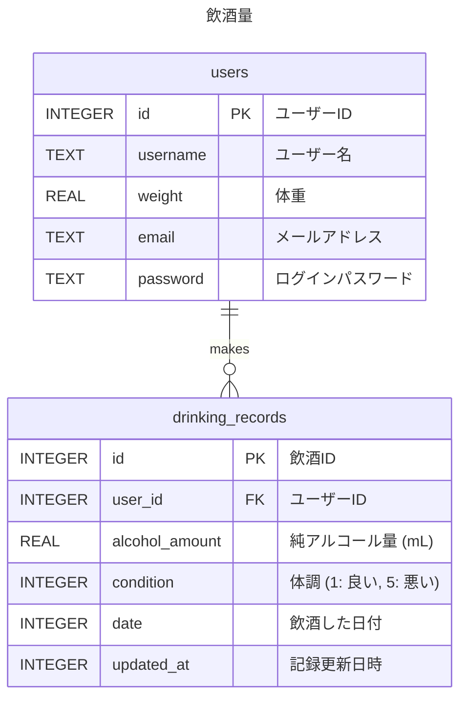

# Alcoho-Rhythm

## ER図

## tweetデータベース

```mermaid
---
title: "飲酒量"
---
erDiagram
    users ||--o{ drinking_records : "makes"

    users {
        INTEGER id PK "ユーザーID"
        TEXT username "ユーザー名"
        REAL weight "体重"
        TEXT email "メールアドレス"
        TEXT password "ログインパスワード"
    }

    drinking_records {
        INTEGER id PK "飲酒ID"
        INTEGER user_id FK "ユーザーID"
        REAL alcohol_amount "純アルコール量 (mL)"
        INTEGER condition "体調 (1: 良い, 5: 悪い)"
        INTEGER date "飲酒した日付"
        INTEGER updated_at "記録更新日時"
    }
```
