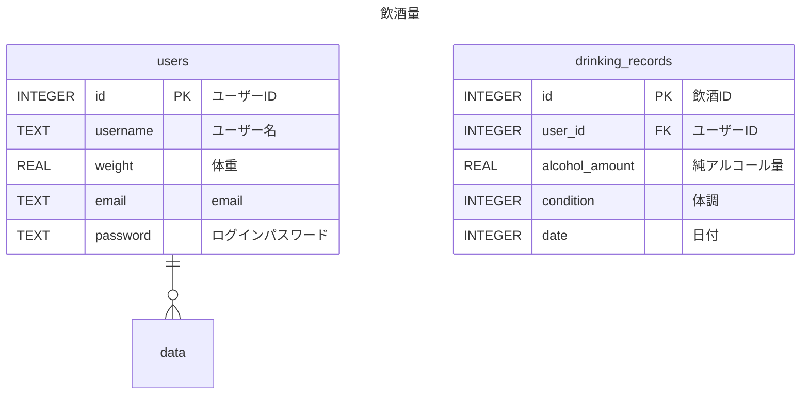

# Alcoho-Rhythm

## ER図

## tweetデータベース

```mermaid
---
title: "飲酒量"
---
erDiagram
    users ||--o{ data : ""

    users {
        INTEGER id PK "ユーザーID"
        TEXT username "ユーザー名"
        REAL weight "体重"
        TEXT email "email"
        TEXT password "ログインパスワード"
    }

    drinking_records {
        INTEGER id PK "飲酒ID"
        INTEGER user_id FK "ユーザーID"
        REAL alcohol_amount "純アルコール量"
        INTEGER condition "体調"
        INTEGER date "日付"
    }
```
